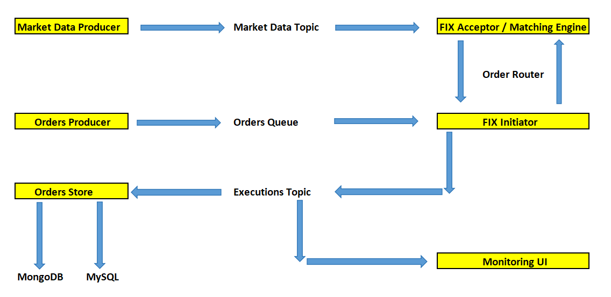

# Stock Exchange Simulator

> A stock exchange, securities exchange, or bourse is an exchange where stockbrokers and traders can buy and sell
> securities, such as shares of stock, bonds and other financial instruments.

The basic function of an exchange is to facilitate the matching of buyers and sellers efficiently.

Tools used:

- JDK 8
- QuickFIX/J
- ActiveMQ
- MongoDB
- MySQL
- Maven
- JUnit 5, Mockito
- IntelliJ IDE

Here we are going to build a mini stock exchange simulator with the following components or services:

**_Random generation of market data and orders_**

- **Market data feed**: For a given **stock**, we will create random bid-ask **prices** and **sizes** and then publish
  them onto a **topic** every `n` seconds.
- **Orders feed**: For a given **stock**, we will create random **market** and **limit** orders and then publish them
  onto a **queue** every `n` seconds.

**Market** orders are always filled because it will execute at whatever the ask/bid prices are available in market data.

**Limit** orders will be filled only if their limit price and quantity match the market data.

**_FIX engines using QuickFIX/J_**

The [Financial Information eXchange](https://en.wikipedia.org/wiki/Financial_Information_eXchange) (FIX) protocol is a
messaging standard developed specifically for the real-time electronic exchange of securities transactions.

FIX is a public-domain specification owned and maintained by [FIX Protocol Ltd](https://www.fixtrading.org/).

We will be using open-source [QuickFIX/J](https://quickfixj.org/) to build our FIX engines:

- **FIX acceptor**: listens on the **market data** and **orders queues** and provides order execution by a matching
  engine.
- **FIX initiator**: listens to the **orders queue** and forwards them to the **FIX acceptor**. If the acceptor replies
  with filled orders, then it publishes them on a **topic**.

**_Databases_**

We will be using **MongoDB** and **MySQL** databases to store executed and rejected orders.

**_Monitoring UI_**

Display live executions, rejections, order statistics and market data from the data stored in the **MongoDB**.

## Start the Exchange Simulator

The whole simulator can be started in the following sequence:

1. `ExchangeSimulatorServicesRunner` starts all the support services, namely:
    - `MarketDataProducer`: it builds random ask and bid prices for a selected range of symbols and sends them to a
      **queue**, every X seconds.
    - `OrdersProducer`: it builds random buy/sell market and limit orders and sends them to a queue, every X seconds.
    - `OrdersBackEndStore`: it subscribes to the `ExecutedOrdersTopic` to receive fully filled orders and stores them to
      MySQL and MongoDB databases.
    - `ExchangeSimulatorStatsRunner`: statistics service, which builds various statistics on aggregated data and prints
2. `ExchangeSimulatorServer` starts the **FIX acceptor** and **matching engine**.
3. `OrderRouter` starts the **OMS** and **FIX initiator**.
4. `ExchangeSimulatorUI` starts the monitor UI.

